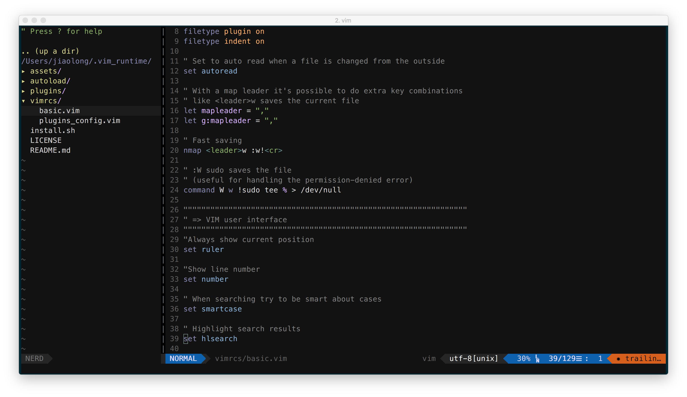

# My Vim Configuration

## Install
```shell
git clone --recursive https://github.com/Jiaolong/my_vimrc.git ~/.vim_runtime
sh ~/.vim_runtime/install.sh
```

## Screen shot


## Known issues
- vim-airline is not showing symbols properly?
Install powerline fonts:
```shell
git clone https://github.com/powerline/fonts.git
sudo ./fonts/install.sh
```
Then you change your terminal fonts into powerline fonts, e.g., `Meslo LG L DZ`.

## Reference
[The Ultimate vimrc](https://github.com/amix/vimrc.git)
